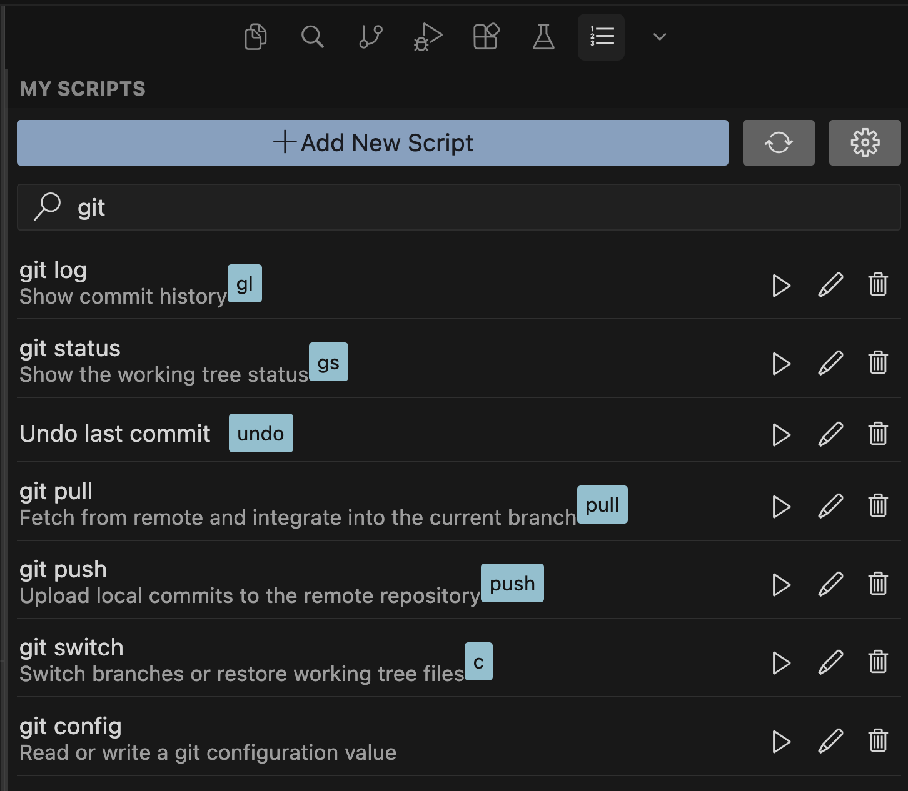
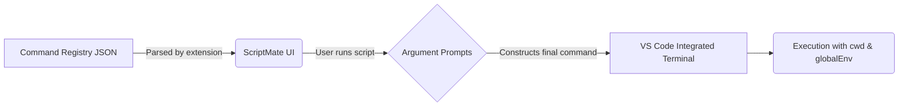

# ScriptMate: Your VS Code Scripting Companion

ScriptMate helps execute and maintain any script/command (`shell`, `zx`, `node`, `git`, etc.) directly within Code Editor with ease. It provides a convenient interface for managing and running your frequently used scripts along with thier aliases, complete with argument handling and a dedicated view for easy access. More than just a script alias.

## Demos

**▶️ [See ScriptMate in action (YouTube Demo)](https://youtu.be/HSNL7baGEVY)**

## Quick Start

1. **Install** from the VS Code Marketplace or Open VSX (Cursor).
2. **Open ScriptMate**: Go to the Activity Bar and click on the ScriptMate icon to open **My Scripts**.
3. **Configure**: Click the gear icon in the side panel to open **Settings**. Set `scriptmate.customCommandsPath` to a JSON file of your choice (if left blank, it defaults to VS Code's global storage).
4. **Add a script**: Click the "+" button in the My Scripts view to define your command via the UI.
5. **Run**: Click the play button next to your script. If arguments are defined, you'll be prompted for them, and you can also add optional "additional parameters" right before execution!

## Features at a Glance

- **Custom Script Management**: Define your scripts and their arguments via a rich UI or a simple JSON file. [Details →](docs/commands-schema.md)
- **Argument Prompts**: Supports `string`, `boolean`, and `enum` arguments with default values and validation. [Details →](docs/commands-schema.md)
- **Additional Parameters**: Append extra arguments on the fly at run time before the command executes.
- **Side Panel Sync**: Instantly reload your commands list from disk using the side panel refresh button if you edit the JSON externally.
- **Global Environment Variables**: Inject variables like `${workspaceFolder}` into all your executed scripts.
- **Shell Aliases (`shellAlias`)**: Automatically sync a POSIX shell function to your `~/.zshrc` or `~/.bashrc` to run your script from any terminal!

## How it works

## Settings

Accessible via the ScriptMate Settings webview (gear icon) or VS Code standard settings (`File > Preferences > Settings`).

| Setting                         | Description                                                                               |
| ------------------------------- | ----------------------------------------------------------------------------------------- |
| `scriptmate.customCommandsPath` | Absolute path to your JSON definitions. Leave blank to use VS Code global storage.        |
| `scriptmate.globalEnv`          | VS Code variables applied to all scripts (e.g. `{"PROJECT_ROOT": "${workspaceFolder}"}`). |

## Commands

- **`ScriptMate: Execute Registered Script...`** in the Command Palette allows running scripts without opening the side bar.
- Available actions in the **My Scripts** view: **Run**, **Add**, **Edit**, **Delete**, and **Sync**.

## Configure with AI

ScriptMate is AI-friendly! You can ask an AI agent (like Cursor) to manage your `scriptmate-commands.json` file for you.

Use [docs/agent-prompts.md](docs/agent-prompts.md) when an agent edits your commands file to ensure perfectly formatted configurations.

## Shell Aliases (`shellAlias`)

If you configure a `shellAlias` for your script, ScriptMate edits your shell rc file between marker comments and writes a **shell function**, not just an alias.

- This allows quoting to stay simple and extra CLI args are forwarded via `"$@"`.
- **Note**: Ensure you run `source ~/.zshrc` (or the respective file) after the first write or reload your terminal. Names must be unique. Merge conflicts are possible if edited manually in the marked region.

## Learn More

- [Command Schema & Argument Assembly](docs/commands-schema.md)
- [CHANGELOG.md](CHANGELOG.md)
- [GitHub Issues](https://github.com/ankitkaushik24/scriptmate/issues)
